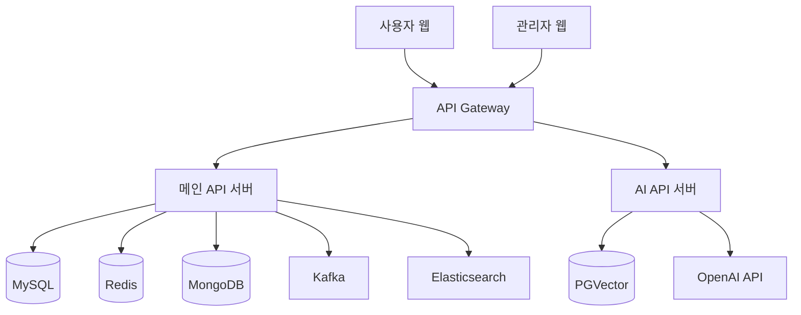

# 🎯 LuckyDoki - 실시간 커머스 플랫폼

## 프로젝트 핵심 목표
- 대용량 트래픽 처리와 성능 최적화에 중점을 둔 실시간 커머스 플랫폼 구축
- 분산 환경에서의 데이터 일관성과 동시성 제어
- 실시간 데이터 처리 및 검색 기능 고도화

 * 사용자: www.luckydoki.shop
 * 관리자: www.admin.luckydoki.shop

 

## 📂 프로젝트 구조

### Backend Reposito선
- MongoDB Atlas 로 챗봇 채팅 내역 기록/관리 
- 프롬프트 개선으로 정확한 응답 생성

 

## 🚨 트러블 슈팅

### 1. 대용량 쿠폰 발급 시스템
- **문제**: 동시 다발적 쿠폰 발급 요청으로 인한 성능 저하
- **해결**: 
  - Kafka를 도입하여 비동기 처리
  - Redisson 분산락으로 동시성 제어
  - 처리량 300% 향상

### 2. 실시간 검색 성능
- **문제**: 한글 검색 시 정확도 및 속도 저하
- **해결**:
  - Elasticsearch 한글 형태소 분석기 적용
  - 검색 결과 캐싱 도입
  - 응답 시간 70% 개선

### 3. 이미지 로딩 최적화
- **문제**: 대용량 이미지로 인한 페이지 로딩 지연
- **해결**:
  - CloudFront CDN 도입
  - 이미지 최적화 및 압축
  - 로딩 시간 60% 단축

### 4. AI 응답 생성 최적화
- **문제**: 
  - RAG 시스템의 높은 지연 시간
  - 부정확한 컨텍스트 참조
- **해결**:
  - 벡터 검색 인덱스 최적화
  - 컨텍스트 윈도우 사이즈 조정
  - 응답 시간 50% 개선, 정확도 30% 향상

 

## CI/CD 배포 아키텍쳐
- GitHub Actions를 통한 자동화된 빌드/배포
- Docker 컨테이너화로 일관된 환경 제공
- AWS Route53를 도메인 기반 라우팅 설정

 

## 🛠 기술 스택
- **Backend**: Spring Boot 3.4.2, Java 17
- **Database**: MySQL, MongoDB, Redis
- **Message Queue**: Kafka
- **Search Engine**: Elasticsearch
- **Monitoring**: ELK Stack
- **DevOps**: AWS, CloudFront
- **Others**: WebSocket, FCM, Google Translation API
