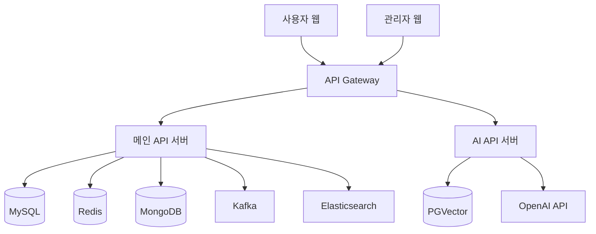

# 🎯 LuckyDoki - 실시간 커머스 플랫폼

## 프로젝트 핵심 목표
- 대용량 트래픽 처리와 성능 최적화에 중점을 둔 실시간 커머스 플랫폼 구축
- 분산 환경에서의 데이터 일관성과 동시성 제어
- 실시간 데이터 처리 및 검색 기능 고도화

 

## 📂 프로젝트 구조

 * 사용자: www.luckydoki.shop
 * 관리자: www.admin.luckydoki.shop
 * swagger: https://api.luckydoki.shop/swagger-ui/index.html

### Backend Repositories
1. **[luckydoki-api](https://github.com/himedia-project/luckydoki-api)**
   - 메인 백엔드 API 서버
   - Spring Boot 3.4.2, Java 17 기반
   - 주요 기능: 인증/인가, 상품/주문 관리, 결제, 알림

2. **[luckydoki-ai-api](https://github.com/himedia-project/luckydoki-ai-api)**
   - AI 서비스 전용 백엔드 서버
   - OpenAI, PGVector 기반 RAG 시스템
   - 챗봇, admin 비즈니스 보고서 작성

### Frontend Repositories
1. **[luckydoki-user](https://github.com/himedia-project/luckydoki-user)**
   - 사용자용 웹 클라이언트
   - React.js 기반 SPA
   - 기술 스택:
     - JavaScript/React.js
     - CSS Modules
     - WebSocket 클라이언트
     - FCM 클라이언트

2. **[luckydoki-admin](https://github.com/himedia-project/luckydoki-admin)**
   - 관리자용 대시보드
   - React.js 기반 어드민 패널
   - 기술 스택:
     - JavaScript/React.js
     - 실시간 대시보드 대시보드
     - 문서 생성, 비즈니스 보고서, 상품 엑셀 upload/download
     - 관리자 권한으로 각 도메인 관리리

 

## 기획도(feat.Figma) && ERD

https://www.figma.com/design/fKeAplwU25tyqQQlonz3oI/luckydoki?node-id=0-1&t=gSTm0qvqKv7m1rM5-1

 

## 🔑 KEY SUMMARY

### 1. 실시간 처리 시스템

- WebSocket 기반 실시간 1:1 채팅
- Firebase Cloud Messaging 푸시 알림
- Redis 기반 실시간 인기 검색어 및 최근 본 상품
- mongoDB Atlas 기반 실시간 채팅 내역 저장

### 2. 검색 엔진

- Elasticsearch 한글 형태소 분석
- 통합 검색 (상품 + 커뮤니티)
- Google Translation API 자동 번역
- ELK 로깅 시스템 구축

### 3. 인증/보안

- JWT + Redis 기반 토큰 관리
- 분산 환경 세션 관리
- Spring Security 기반 인증/인가
- Oauth2 카카오, 구글 로그인 인증

### 4. 대용량 처리

- Kafka 기반 쿠폰 발급 시스템
- Redisson 분산락 동시성 제어
- CloudFront CDN 이미지 최적화

### 5. AI 챗봇, 비즈니스보고서

- RAG 아키텍처: OpenAI GPT 모델 기반 챗봇 시스템
- PGVector: 벡터 데이터베이스 기반 유사도 검색 구현
- AI 비즈니스 보고서: 판매 데이터 분석 및 자동 인사이트 도출

 

## 🔧 기술적 고도화

### 1. 분산 처리 아키텍처
- Redis Sentinel 구성으로 고가용성 확보
- Kafka를 통한 비동기 메시지 처리
- Redisson 분산락으로 데이터 정합성 보장

### 2. 모니터링 및 로깅
- ELK 스택 구축 (Elasticsearch, Logstash, Kibana)
- 로그 중앙화 및 실시간 모니터링
- 성능 메트릭 수집 및 분석

### 3. 캐싱 전략
- Redis 다중 계층 캐싱
- CloudFront CDN 엣지 캐싱
- 검색 결과 캐싱

### 4. AI 챗봇 시스템
- **RAG(Retrieval-Augmented Generation) 아키텍처**
- OpenAI GPT 모델 기반 자연어 처리
- MongoDB Atlas 로 챗봇 채팅 내역 기록/관리 
- 프롬프트 개선으로 정확한 응답 생성

 

## 🚨 트러블 슈팅

### 1. 대용량 쿠폰 발급 시스템
- **문제**: 동시 다발적 쿠폰 발급 요청으로 인한 성능 저하
- **해결**: 
  - Kafka를 도입하여 비동기 처리
  - Redisson 분산락으로 동시성 제어
  - 처리량 300% 향상

### 2. 실시간 검색 성능
- **문제**: 한글 검색 시 정확도 및 속도 저하
- **해결**:
  - Elasticsearch 한글 형태소 분석기 적용
  - 검색 결과 캐싱 도입
  - 응답 시간 70% 개선

### 3. 이미지 로딩 최적화
- **문제**: 대용량 이미지로 인한 페이지 로딩 지연
- **해결**:
  - CloudFront CDN 도입
  - 이미지 최적화 및 압축
  - 로딩 시간 60% 단축

### 4. AI 응답 생성 최적화
- **문제**: 
  - RAG 시스템의 높은 지연 시간
  - 부정확한 컨텍스트 참조
- **해결**:
  - 벡터 검색 인덱스 최적화
  - 컨텍스트 윈도우 사이즈 조정
  - 응답 시간 50% 개선, 정확도 30% 향상

 

## CI/CD 배포 아키텍쳐
- GitHub Actions를 통한 자동화된 빌드/배포
- Docker 컨테이너화로 일관된 환경 제공
- AWS Route53를 도메인 기반 라우팅 설정

 

## 🛠 기술 스택
- **Backend**: Spring Boot 3.4.2, Java 17
- **Database**: MySQL, MongoDB, Redis
- **Message Queue**: Kafka
- **Search Engine**: Elasticsearch
- **Monitoring**: ELK Stack
- **DevOps**: AWS, CloudFront
- **Others**: WebSocket, FCM, Google Translation API
